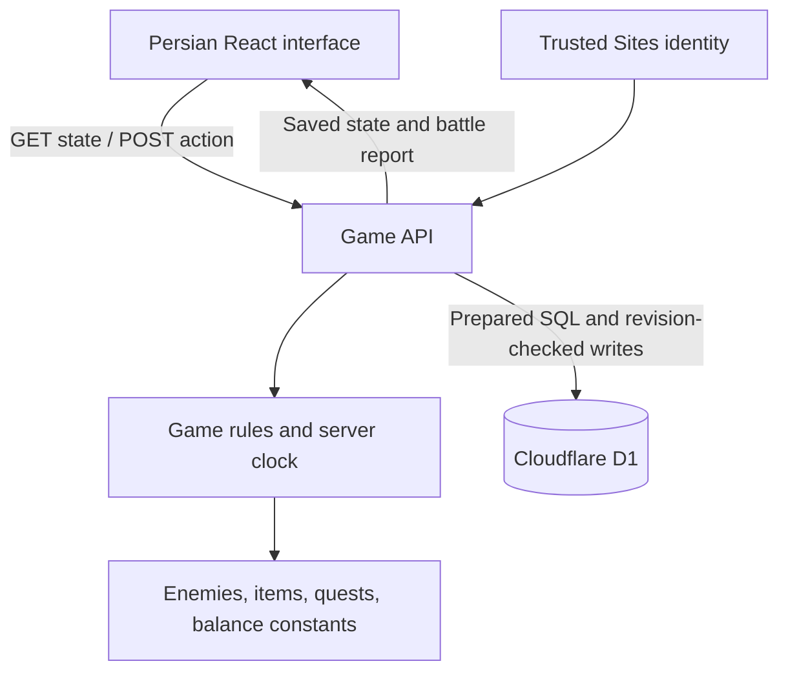

# مبارز — Mobarez

**افسانه‌ات را زندگی کن — Live your legend.**

Mobarez is a Persian, right-to-left browser RPG set in a fictional, myth-inspired Iran. Players fight NPCs, collect equipment, train their character, complete quests, and explore a staged dungeon. The design draws on Gladiatus's PvE loop, with original game rules, writing, and artwork.

**Stage:** playable private build, version `0.2.0` — a Gladiatus-style town/country RPG paced for at least a month of play. Public release readiness is still pending.

**Hosted game:** [mobarez.hdbrzgr.chatgpt.site](https://mobarez.hdbrzgr.chatgpt.site) — access was last confirmed as owner-only on 14 September 2026.

## Documentation

| Document                                             | Purpose                                                                                            |
| ---------------------------------------------------- | -------------------------------------------------------------------------------------------------- |
| [README.md](README.md)                               | Product overview, setup, architecture, and operating instructions                                  |
| [PROGRESS.md](PROGRESS.md)                           | Implemented features, verification evidence, and known issues                                      |
| [PLAN.md](PLAN.md)                                   | Priorities, milestones, dependencies, and acceptance criteria                                      |
| [Character UX](docs/UX.md)                           | Gender-first onboarding, visible equipment, costumes, concept art and implementation specification |
| [Research](docs/research.md)                         | Gladiatus research, source links, adaptation decisions, and balance hypotheses                     |
| [Gladiatus adaptation](docs/gladiatus-adaptation.md) | Full Gladiatus-system inventory, Iranian names, and G1–G5 expansion waves                          |
| [Artwork](docs/artwork.md)                           | Original generated assets, prompts, and font provenance                                            |

## Next milestones

Version 0.2 implements most of the G1–G4 waves from [docs/gladiatus-adaptation.md](docs/gladiatus-adaptation.md): town/country shell, eight slots, bag and packages, procedural affix loot, forge, work, split points, arena, daily missions, titles, companions, and a highscore board. Remaining: wearable art for the five new slots, hosted release of save version 2, and a browser/accessibility acceptance pass ([PROGRESS.md](PROGRESS.md)).

## The game

The loop is Gladiatus-shaped: **spend expedition and dungeon points → collect packages → equip, sell or smelt → train and forge → claim daily and story rewards → push into the next province.** Everything is original Iranian fiction and original numbers.

### Town (شهر)

| Screen   | Persian | What it does                                                                                                                                                       |
| -------- | ------- | ------------------------------------------------------------------------------------------------------------------------------------------------------------------ |
| Overview | پهلوان  | Full-body hero, eight slots (weapon, shield, helmet, armour, gloves, boots, ring, amulet), combat sheet, bag grid with compare/equip/sell/smelt, cosmetic wardrobe |
| Packages | بسته‌ها | Loot inbox; take one/all, sell or smelt, bulk-sell/smelt by quality; 7-day expiry into coins                                                                       |
| Market   | بازار   | 12 level-matched items that rotate every 6 hours (paid refresh), three foods, bag upgrades to 100 slots                                                            |
| Forge    | آهنگری  | Upgrade +1…+10 (6 % per step), refine quality one colour, smelt items into gem dust                                                                                |
| Training | زورخانه | Six stats: strength, agility, vitality, luck, charisma (فرّه), intelligence (خرد); level-based cap                                                                 |
| Temple   | معبد    | Four seeded daily missions (Iran-time days) and four two-hour blessings                                                                                            |
| Work     | کار     | Four jobs for 1/2/4/8 hours; pays at the end, blocks fighting, cancel forfeits pay                                                                                 |

### Country (کشور)

| Screen      | Persian  | What it does                                                                                                              |
| ----------- | -------- | ------------------------------------------------------------------------------------------------------------------------- |
| Expeditions | لشکرکشی  | Nine provinces from Pars to Mount Qaf, 36 opponents (each province ends with a boss), levels 1–73                         |
| Dungeons    | سیاه‌چال | Nine staged dungeons (levels 3–80), normal and hard mode, guaranteed lapis+ boss loot, fame, up to three hired companions |
| Arena       | میدان    | Five rotating NPC rivals near your level (clearly labelled as not players); honour and coins                              |

### Ledger (دفتر)

41 story quests from the first wolf to the Qaf throne, seven honour ranks and thirteen earned titles with percentage bonuses (only the active one applies), a statistics record, a real-player highscore board (honour or fame), and the last 25 battle reports with round-by-round logs.

### Current rules

[Content](lib/game/content.ts) and the [engine](lib/game/engine.ts) are authoritative.

| Rule              | Value                                                                                                                                                                      |
| ----------------- | -------------------------------------------------------------------------------------------------------------------------------------------------------------------------- |
| Expedition points | 24 max, +1 every 6 minutes; 1 per fight; 20 s cooldown                                                                                                                     |
| Dungeon points    | 12 max, +1 every 12 minutes; 1 per stage; 20 s cooldown                                                                                                                    |
| Arena             | One fight every 10 minutes from level 2                                                                                                                                    |
| Health            | Regenerates 1.2–3 % of max per minute (intelligence, early-level bonus, Anahita blessing); food heals 25/50/100 %                                                          |
| Fight requirement | At least 10 % health, not working                                                                                                                                          |
| Combat            | Up to 25 rounds; hit/dodge (agility), crit ×1.7 (luck), block halves damage (strength + shield), double hit (charisma); after round 25 the side with more health left wins |
| Loot              | First kill always drops; then 30 % (bosses 60 %); quality ساده → فیروزه → لاجورد → ارغوان → کهربا; any affix means at least فیروزه                                         |
| Experience        | Reduced against opponents more than two levels below you; level cap 80                                                                                                     |
| Level-up          | +1 strength, +1 vitality, full health                                                                                                                                      |
| Selling           | 25 % of item value; market buys at 110 %                                                                                                                                   |

### Pacing evidence

`npm run simulate` plays the real engine with a bot for 30 in-game days under three schedules. With the current tables:

| Schedule | Sessions/day | Day-30 level | Provinces reached                             |
| -------- | ------------ | ------------ | --------------------------------------------- |
| casual   | 2            | ≈ 38         | 6 of 9                                        |
| engaged  | 5            | ≈ 60         | 8 of 9                                        |
| hardcore | 12           | ≈ 70         | 9 of 9, last boss and Qaf dungeon still ahead |

The test suite asserts that no schedule finishes the final boss or dungeon within 30 days and that every schedule still gains levels every week.

## Local development

### Requirements

- Node.js `22.13.0` or newer, as declared in [package.json](package.json).
- npm and access to the package registry for installation.
- A local environment capable of running Cloudflare's development runtime.

Normal local gameplay needs no API key or manually configured production database credential. Authentication and D1 storage use the local Sites development plugin and Cloudflare emulation.

### First-time setup

Run these commands from the repository root:

```sh
npm ci
npm run build
npm run db:local
npm run dev
```

The build generates `dist/server/wrangler.json`, which the database initialization script requires. `db:local` applies the initial migration to the local `.wrangler/state` database.

Open the Local URL printed by the development server, normally `http://localhost:3000/`. Click **ورود به بازی** to establish the local development identity. The plugin supplies one shared local test identity; it is not a public registration flow.

**Run `db:local` only for a fresh database.** It executes the initial SQL file directly and is not an idempotent migration runner. If `players` already exists, keep the database and skip this step.

For subsequent sessions:

```sh
npm run dev
```

Local saves live under `.wrangler/state`. Preserve that directory to keep local progress. Local and hosted databases are separate.

### Commands

| Command                      | Purpose                                                                   |
| ---------------------------- | ------------------------------------------------------------------------- |
| `npm run dev`                | Development server with local identity support and HMR                    |
| `npm run build`              | Compile the application and generate Worker deployment output             |
| `npm run start`              | Inspect compiled output through Wrangler; see authentication caveat below |
| `npm run typecheck`          | TypeScript verification                                                   |
| `npm run lint`               | Oxlint, including configured type-aware and accessibility rules           |
| `npm run format`             | Format supported project files; this modifies files                       |
| `npm test`                   | Bundle and run the game-engine tests (including the 30-day pacing test)   |
| `npm run simulate [profile]` | Print the 30-day pacing tables for casual / engaged / hardcore schedules  |
| `npm run db:generate`        | Generate SQL migrations from the Drizzle schema                           |
| `npm run db:local`           | Apply the initial migration to a fresh local database                     |
| `node scripts/api-smoke.mjs` | Run mutating local API smoke checks against a running dev server          |

`npm run start` does not install the Vite plugin's local sign-in middleware and does not select the same persistence directory explicitly. It is not the normal signed-in development workflow. Use `npm run dev` for local gameplay.

### Validation

```sh
npm run typecheck
npm run lint
npm test
npm run build
```

With the initialized development server running in another terminal:

```sh
node scripts/api-smoke.mjs
```

For a different local port:

```sh
MOBAREZ_TEST_ORIGIN=http://localhost:3001 node scripts/api-smoke.mjs
```

The smoke script accepts only loopback hostnames. Use disposable local test data: it changes the local character name, increments save revisions, and finishes by setting the name to **پهلوان تازه‌نفس**. It also assumes the final dungeon quest is not yet claimable. It is not safe to treat it as a read-only health check or as an independent multi-user isolation test.

See [PROGRESS.md](PROGRESS.md#verification-record) for what has actually passed and what remains unverified.

## Architecture



| Layer        | Implementation                                                                    |
| ------------ | --------------------------------------------------------------------------------- |
| Client       | React 19, TypeScript; screen selection and transient UI state in React            |
| Framework    | Vinext with Vite; Cloudflare Worker-compatible output                             |
| Interface    | Tailwind CSS, shared shadcn/Base UI primitives, Lucide icons                      |
| Localization | Persian copy, RTL document, Persian number formatting, self-hosted Vazirmatn      |
| Game rules   | Focused TypeScript engine with injectable time/randomness for tests               |
| Persistence  | D1 prepared statements; Drizzle defines the schema and generates migrations       |
| Identity     | Trusted platform user ID; local development identity supplied by the Sites plugin |
| Assets       | Original generated PNGs and a local font; no runtime image generation service     |

### Repository map

```text
app/
  page.tsx              Town/country shell, resource bar, player column, dialogs
  globals.css           Theme, RTL layout, responsive rules, and motion
  layout.tsx            Persian document and social-preview metadata
  api/game/route.ts     Authenticated state loading and action endpoint
lib/game/
  content.ts            Provinces, enemies, dungeons, item bases, affixes, jobs, foods,
                        blessings, companions, titles, story and daily quest tables
  engine.ts             Save v2 + v1 migration, items, combat, points, market, arena,
                        missions, forge, work, titles, companions, regeneration
  character-art.ts      Typed character, weapon, charm and costume asset mappings
components/character/   Gender setup and full-body stage
components/game/        One file per screen group (overview, town, country, ledger, board)
components/ui/          Shared button, input, dialog, and progress primitives
db/
  schema.ts             Drizzle definition of the players table
  index.ts              D1 binding access
  env.d.ts              Cloudflare binding types
drizzle/                Generated SQL and migration snapshots
scripts/                Engine test runner, 30-day pacing simulator, API smoke checks
tests/                  Engine regression tests and seeded simulations
public/                 Game artwork, fonts, favicon, and social card
docs/                   Research and artwork provenance
.openai/hosting.json    Existing Sites project ID and logical storage bindings
```

### State and persistence

One `players` row stores each platform user's game state:

| Column       | Role                                                                                 |
| ------------ | ------------------------------------------------------------------------------------ |
| `user_id`    | Primary key, taken from trusted request identity                                     |
| `state`      | JSON containing character, appearance, inventory, quests, timers, and recent reports |
| `revision`   | Optimistic concurrency counter                                                       |
| `updated_at` | Timestamp of the last committed mutation                                             |

The server owns combat rolls, rewards, costs, inventory rules, and time gates. Browser state is a display of the server result, not the authoritative save.

A GET calculates elapsed regeneration without rewriting an existing row. An action recalculates regeneration and commits the resulting state. Offline recovery therefore requires no background job. The UI estimates timers from server time and polls approximately every 30 seconds while visible and not submitting an action.

Writes use `UPDATE ... WHERE user_id = ? AND revision = ?`. Only one concurrent request with the same revision can commit. The saved `lastActionId` suppresses an immediate retry of the last committed request; older requests are rejected through revision checking. This is not a complete persistent history of all request IDs.

The save JSON uses `saveVersion: 2`. `normalizeSave` migrates version-1 (and unversioned) saves on read: equipped weapon/armour/charm become item instances (charm → amulet), the remaining inventory moves into the bag, energy is rescaled to expedition points, food becomes bread, defeated enemies become kill counts, dungeon progress and claimed quests are kept. Item instances are `{ uid, base, level, quality, prefix?, suffix?, upgrade }`; stats and prices are always recomputed from content tables, never stored. Changing stable content IDs can still break saves; plan compatibility before altering them.

All time effects (points, health, finished work, expired packages, daily reset, market rotation) are applied by the pure `regenerate(state, now)`; daily missions, arena rivals and market stock are derived from a per-save seed, so the client can display them and the server re-derives them to validate actions.

Gameplay actions other than `createCharacter` are rejected until the player finishes gender/name setup.

### API contract

All responses set `Cache-Control: private, no-store`.

**`GET /api/game`** loads or creates the authenticated character and returns `{ state, revision, now }`.

**`POST /api/game`** accepts JSON shaped like this; use the current revision returned by GET and a fresh request ID for a new action:

```json
{
  "action": { "type": "fight", "enemyId": "wolf" },
  "revision": 0,
  "requestId": "a6bb3f38-49e7-4fab-8d31-475708ba58d8"
}
```

| Action type                                             | Fields                                                                 |
| ------------------------------------------------------- | ---------------------------------------------------------------------- |
| `fight`                                                 | `enemyId`                                                              |
| `dungeon`                                               | `dungeonId`, optional `hard` (only chosen at stage 1, after one clear) |
| `dungeonReset`                                          | `dungeonId`                                                            |
| `arena`                                                 | `index` 0–4 of the current rivals                                      |
| `train`                                                 | `stat`: one of the six stats                                           |
| `equip`, `sell`, `smelt`, `upgrade`, `refine`, `take`   | `uid` of an item (bag, package, or worn as each action allows)         |
| `unequip`                                               | `slot`                                                                 |
| `takeAll`                                               | —                                                                      |
| `bulkPackages`                                          | `mode`: `sell` / `smelt`, `maxQuality` 0–4                             |
| `buy`                                                   | `index` into the current market stock                                  |
| `refreshMarket`, `buyBag`, `cancelWork`                 | —                                                                      |
| `buyFood`                                               | `foodId`, `count` 1–20                                                 |
| `eat`                                                   | `foodId`                                                               |
| `blessing`                                              | `blessingId`                                                           |
| `work`                                                  | `jobId`, `hours` 1/2/4/8                                               |
| `hireCompanion`                                         | `companionId`                                                          |
| `setParty`                                              | `companionIds`                                                         |
| `claim`                                                 | `questId`                                                              |
| `claimDaily`                                            | `index`                                                                |
| `setTitle`                                              | `titleId` or `null`                                                    |
| `rename`, `createCharacter`, `setGender`, `wearCostume` | as in version 1                                                        |

**`GET /api/game?board=honour|fame`** returns the top 25 created characters by honour or fame, marking the caller's row.

Successful actions return `{ state, revision, now, message }`, plus `battle` for combat. Rejected actions return `{ error }`; an initial stale-revision response also includes the latest state. A conflict detected during the SQL update requires a fresh GET.

Status handling currently includes `400` for invalid or ineligible actions, `401` for an unauthenticated GET, `403` for an explicitly cross-site POST, `409` for revision conflicts, `413` for a parsed text body exceeding 2,048 characters, `415` for unsupported content type, and `503` for service/storage failures. An unauthenticated POST currently returns `400`; consistent authentication statuses are an open task.

After a network failure, refresh state before submitting another mutation: the previous request may already have committed. Clients must never submit their own rewards or modified save objects.

## Storage changes and hosting

For a database schema change:

1. Update [db/schema.ts](db/schema.ts).
2. Run `npm run db:generate` and inspect the new SQL and snapshot.
3. Apply the new SQL file to the local database using the generated Worker config and `--persist-to .wrangler/state`.
4. Test existing-save compatibility as well as a new character.
5. Include the migration in the validated deployment package.

The current private deployment uses the existing project in [.openai/hosting.json](.openai/hosting.json), with logical D1 binding `DB`. R2 is unused. Sites manages the actual hosted resource identifiers and applies packaged migrations.

For a Sites release, validate the source, push the matching source revision, package the build output and migrations, save a version, deploy to the intended existing audience, and confirm deployment success. Never place source-write credentials in the repository or change the audience as a side effect of an update. `npm run build` alone does not publish the game.

The API trusts platform-provided identity headers. A deployment outside Sites needs an authentication boundary that verifies identity and strips forged identity headers; it cannot safely expose the existing handler directly to arbitrary client headers.

## Troubleshooting

| Symptom                                                             | Check / action                                                                   |
| ------------------------------------------------------------------- | -------------------------------------------------------------------------------- |
| “برای ذخیرهٔ پیشرفت، وارد حساب خود شو.”                             | Use the sign-in link; for local play use the Vite development server on loopback |
| Local database reports `no such table: players`                     | Build once, then apply the initial migration to the dev persistence directory    |
| Initial migration reports `table already exists`                    | Skip initial setup; apply only unapplied new migrations                          |
| A purchase or battle returns a conflict                             | Refresh the save, inspect the result, then decide whether to submit again        |
| Build output exists but local gameplay is unauthenticated           | Use `npm run dev`; Wrangler start alone lacks the dev sign-in middleware         |
| Changing equipment does not raise current health to the new maximum | Extra maximum health is capacity; food/passive recovery fills it                 |
| A locked opponent cannot be fought                                  | Defeat the previous opponent and meet the region entry requirement               |
| An update breaks an existing character                              | Check `normalizeSave`; version-1 saves migrate automatically on the first read   |

## Scope, provenance, and readiness

This is a private PvE game. Public account registration, recovery, player-vs-player combat, guilds, auctions, payments, analytics, and operational admin tools are not implemented. Arena rivals are generated NPCs. Later regions reuse the three-portrait enemy atlas and colour-treated versions of the environment artwork; helmets, shields, gloves, boots and rings use icons because no wearable art exists for them yet. Full economy balance, cross-device interaction, accessibility behavior, load handling, and production recovery require further validation.

The project uses original generated artwork and game copy, rather than Gameforge assets or code. Vazirmatn's SIL Open Font License is included in [public/fonts/OFL.txt](public/fonts/OFL.txt). No project-wide source license has been selected or included; do not infer one from the font license.

For dated test results and dependency-audit findings, see [PROGRESS.md](PROGRESS.md). For the next implementation milestones, see [PLAN.md](PLAN.md).
