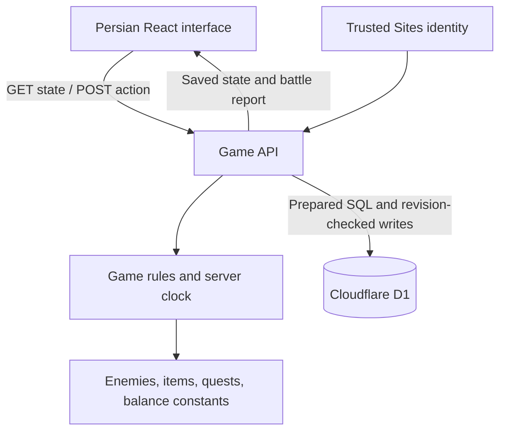

# مبارز — Mobarez

**افسانه‌ات را زندگی کن — Live your legend.**

Mobarez is a Persian, right-to-left browser RPG set in a fictional, myth-inspired Iran. Players fight NPCs, collect equipment, train their character, complete quests, and explore a staged dungeon. The design draws on Gladiatus's PvE loop, with original game rules, writing, and artwork.

**Stage:** playable private MVP, version `0.1.0`. Public release readiness and browser QA are still pending.

**Hosted game:** [mobarez.hdbrzgr.chatgpt.site](https://mobarez.hdbrzgr.chatgpt.site) — access was last confirmed as owner-only on 14 September 2026.

## Documentation

| Document                     | Purpose                                                                                            |
| ---------------------------- | -------------------------------------------------------------------------------------------------- |
| [README.md](README.md)       | Product overview, setup, architecture, and operating instructions                                  |
| [PROGRESS.md](PROGRESS.md)   | Implemented features, verification evidence, and known issues                                      |
| [PLAN.md](PLAN.md)           | Priorities, milestones, dependencies, and acceptance criteria                                      |
| [Character UX](docs/UX.md)   | Gender-first onboarding, visible equipment, costumes, concept art and implementation specification |
| [Research](docs/research.md) | Gladiatus research, source links, adaptation decisions, and balance hypotheses                     |
| [Gladiatus adaptation](docs/gladiatus-adaptation.md) | Full Gladiatus-system inventory, Iranian names, and G1–G5 expansion waves |
| [Artwork](docs/artwork.md)   | Original generated assets, prompts, and font provenance                                            |

## Next milestones

Gender selection, visible equipment and two cosmetic outfits are implemented in source; private release and the full browser acceptance matrix remain to be recorded ([docs/UX.md](docs/UX.md)).

After U0.4, P0 reward fixes, and P1 saves, the next product slice is a Gladiatus-like game shell (city/country, more slots, bags, packages, work). The full system inventory and later waves are in [docs/gladiatus-adaptation.md](docs/gladiatus-adaptation.md).

## The game

The core loop is **choose a fight → review the result → equip loot → train → claim quest rewards → unlock harder content**.

| Screen         | Persian label | Current functionality                                            |
| -------------- | ------------- | ---------------------------------------------------------------- |
| Expeditions    | لشکرکشی       | Three regions, nine enemies, sequential opponent unlocks         |
| Character      | پهلوان        | Rename character, inspect stats, equip or sell inventory items   |
| Dungeon        | سیاه‌چال      | Three persistent stages, solo combat, final relic reward, replay |
| Quests         | مأموریت‌ها    | Five automatically active milestones with manual reward claims   |
| Training       | تمرین‌گاه     | Spend gold on strength, agility, vitality, and luck              |
| Market         | بازار         | Buy eight equipment items and healing food at fixed prices       |
| Battle reports | گزارش نبردها  | Review the last 20 fights and their individual rounds            |

### First play session

1. Open the game and sign in when prompted.
2. Choose **زن** or **مرد**, keep or enter a name, then start.
3. Open **پهلوان** to see the full-body character wearing starter equipment.
4. Choose **لشکرکشی**, then fight **گرگ خاکستری** in **دشت‌های پارس**.
5. Read the result and return to **پهلوان** to preview and equip any useful loot, or try a costume under **پوشاک**.
6. Claim **نخستین گام** under **مأموریت‌ها**.
7. Spend gold in **تمرین‌گاه** or **بازار**. Buying equipment does not automatically equip it.
8. Recover health using **خوردن خوراک**, or wait for passive regeneration.
9. Reach level 3 to unlock Hyrcania and the dungeon; reach level 5 to unlock Alborz.

### Current rules

These are accelerated MVP settings, not reproductions of Gladiatus's formulas. [Content](lib/game/content.ts) and the [engine](lib/game/engine.ts) are authoritative.

| Rule                            | Value                                                                                          |
| ------------------------------- | ---------------------------------------------------------------------------------------------- |
| New character                   | Level 1, 350 gold, 120 health, 12 energy, three food portions                                  |
| Starter equipment               | Iron blade and leather armor, already equipped                                                 |
| Expedition / dungeon stage cost | 1 / 2 energy                                                                                   |
| Energy recovery                 | 1 per minute, up to 12                                                                         |
| Health recovery                 | 6 per 30 seconds, up to the current maximum                                                    |
| Food                            | Costs 20 gold; restores up to 60 health; maximum stock 99                                      |
| Shared combat cooldown          | 8 seconds                                                                                      |
| Minimum health to begin combat  | 20                                                                                             |
| Combat resolution               | Automatic, player attacks first, maximum 20 rounds                                             |
| Defeat                          | No victory gold or loot; 5 XP; health kept at least 1 after combat, before any level-up refill |
| XP needed for the next level    | `80 + (level - 1) × 45`                                                                        |
| Level-up                        | +1 strength, +1 vitality, and full health                                                      |
| Equipment                       | Weapon, armor, and charm; common, rare, and epic rarities                                      |
| Inventory capacity              | 40 equipment copies; food tracked separately                                                   |
| Sale / overflow conversion      | `floor(shop price × 0.4)` gold                                                                 |
| Dungeon completion              | Simorgh relic reward; stage resets for another run                                             |

Defeating the preceding enemy unlocks the next opponent within a region. Region entry uses the region's level requirement; an individual enemy's displayed level is a difficulty indicator, not an additional character-level gate. Dungeon progress survives defeat and leaving the screen.

Overflow rewards and their report totals have known edge cases; see [PROGRESS.md](PROGRESS.md#known-issues-and-limitations).

## Local development

### Requirements

- Node.js `22.13.0` or newer, as declared in [package.json](package.json).
- npm and access to the package registry for installation.
- A local environment capable of running Cloudflare's development runtime.

Normal local gameplay needs no API key or manually configured production database credential. Authentication and D1 storage use the local Sites development plugin and Cloudflare emulation.

### First-time setup

Run these commands from the repository root:

```sh
npm ci
npm run build
npm run db:local
npm run dev
```

The build generates `dist/server/wrangler.json`, which the database initialization script requires. `db:local` applies the initial migration to the local `.wrangler/state` database.

Open the Local URL printed by the development server, normally `http://localhost:3000/`. Click **ورود به بازی** to establish the local development identity. The plugin supplies one shared local test identity; it is not a public registration flow.

**Run `db:local` only for a fresh database.** It executes the initial SQL file directly and is not an idempotent migration runner. If `players` already exists, keep the database and skip this step.

For subsequent sessions:

```sh
npm run dev
```

Local saves live under `.wrangler/state`. Preserve that directory to keep local progress. Local and hosted databases are separate.

### Commands

| Command                      | Purpose                                                                   |
| ---------------------------- | ------------------------------------------------------------------------- |
| `npm run dev`                | Development server with local identity support and HMR                    |
| `npm run build`              | Compile the application and generate Worker deployment output             |
| `npm run start`              | Inspect compiled output through Wrangler; see authentication caveat below |
| `npm run typecheck`          | TypeScript verification                                                   |
| `npm run lint`               | Oxlint, including configured type-aware and accessibility rules           |
| `npm run format`             | Format supported project files; this modifies files                       |
| `npm test`                   | Bundle and run 13 game-engine tests through Node's test runner            |
| `npm run db:generate`        | Generate SQL migrations from the Drizzle schema                           |
| `npm run db:local`           | Apply the initial migration to a fresh local database                     |
| `node scripts/api-smoke.mjs` | Run mutating local API smoke checks against a running dev server          |

`npm run start` does not install the Vite plugin's local sign-in middleware and does not select the same persistence directory explicitly. It is not the normal signed-in development workflow. Use `npm run dev` for local gameplay.

### Validation

```sh
npm run typecheck
npm run lint
npm test
npm run build
```

With the initialized development server running in another terminal:

```sh
node scripts/api-smoke.mjs
```

For a different local port:

```sh
MOBAREZ_TEST_ORIGIN=http://localhost:3001 node scripts/api-smoke.mjs
```

The smoke script accepts only loopback hostnames. Use disposable local test data: it changes the local character name, increments save revisions, and finishes by setting the name to **پهلوان تازه‌نفس**. It also assumes the final dungeon quest is not yet claimable. It is not safe to treat it as a read-only health check or as an independent multi-user isolation test.

See [PROGRESS.md](PROGRESS.md#verification-record) for what has actually passed and what remains unverified.

## Architecture



| Layer        | Implementation                                                                    |
| ------------ | --------------------------------------------------------------------------------- |
| Client       | React 19, TypeScript; screen selection and transient UI state in React            |
| Framework    | Vinext with Vite; Cloudflare Worker-compatible output                             |
| Interface    | Tailwind CSS, shared shadcn/Base UI primitives, Lucide icons                      |
| Localization | Persian copy, RTL document, Persian number formatting, self-hosted Vazirmatn      |
| Game rules   | Focused TypeScript engine with injectable time/randomness for tests               |
| Persistence  | D1 prepared statements; Drizzle defines the schema and generates migrations       |
| Identity     | Trusted platform user ID; local development identity supplied by the Sites plugin |
| Assets       | Original generated PNGs and a local font; no runtime image generation service     |

### Repository map

```text
app/
  page.tsx              Game screens, actions, notifications, and dialogs
  globals.css           Theme, RTL layout, responsive rules, and motion
  layout.tsx            Persian document and social-preview metadata
  api/game/route.ts     Authenticated state loading and action endpoint
lib/game/
  content.ts            Enemy, region, dungeon, item, quest, and costume definitions
  engine.ts             State model, combat, economy, regeneration, appearance, and unlocks
  character-art.ts      Typed character, weapon, charm and costume asset mappings
components/character/   Gender setup, full-body stage, equipment and wardrobe
components/ui/          Shared button, input, dialog, and progress primitives
db/
  schema.ts             Drizzle definition of the players table
  index.ts              D1 binding access
  env.d.ts              Cloudflare binding types
drizzle/                Generated SQL and migration snapshots
scripts/                Engine test runner and local API smoke checks
tests/                  Engine regression tests and seeded simulations
public/                 Game artwork, fonts, favicon, and social card
docs/                   Research and artwork provenance
.openai/hosting.json    Existing Sites project ID and logical storage bindings
```

### State and persistence

One `players` row stores each platform user's game state:

| Column       | Role                                                                     |
| ------------ | ------------------------------------------------------------------------ |
| `user_id`    | Primary key, taken from trusted request identity                         |
| `state`      | JSON containing character, appearance, inventory, quests, timers, and recent reports |
| `revision`   | Optimistic concurrency counter                                           |
| `updated_at` | Timestamp of the last committed mutation                                 |

The server owns combat rolls, rewards, costs, inventory rules, and time gates. Browser state is a display of the server result, not the authoritative save.

A GET calculates elapsed regeneration without rewriting an existing row. An action recalculates regeneration and commits the resulting state. Offline recovery therefore requires no background job. The UI estimates timers from server time and polls approximately every 20 seconds while visible and not submitting an action.

Writes use `UPDATE ... WHERE user_id = ? AND revision = ?`. Only one concurrent request with the same revision can commit. The saved `lastActionId` suppresses an immediate retry of the last committed request; older requests are rejected through revision checking. This is not a complete persistent history of all request IDs.

The save JSON currently uses `saveVersion: 1` with a compatibility normalizer for older unversioned saves. Appearance fields (`gender`, costumes) are added without resetting gold, XP, inventory, or quests. Changing stable gameplay content IDs can still break existing saves; plan compatibility changes before altering them.

Gameplay actions other than `createCharacter` are rejected until the player finishes gender/name setup.

### API contract

All responses set `Cache-Control: private, no-store`.

**`GET /api/game`** loads or creates the authenticated character and returns `{ state, revision, now }`.

**`POST /api/game`** accepts JSON shaped like this; use the current revision returned by GET and a fresh request ID for a new action:

```json
{
  "action": { "type": "fight", "enemyId": "wolf" },
  "revision": 0,
  "requestId": "a6bb3f38-49e7-4fab-8d31-475708ba58d8"
}
```

| Action type            | Fields                                               |
| ---------------------- | ---------------------------------------------------- |
| `fight`                | `enemyId`                                            |
| `dungeon`              | None; the server chooses the saved current stage     |
| `train`                | `stat`: `strength`, `agility`, `vitality`, or `luck` |
| `equip`, `buy`, `sell` | `itemId`; use `food` for a food purchase             |
| `unequip`              | `slot`: `weapon`, `armor`, or `charm`                |
| `heal`                 | None                                                 |
| `claim`                | `questId`                                            |
| `rename`               | `name`, trimmed length 2–24                          |
| `createCharacter`      | `gender`: `female` or `male`; `name` as in `rename`  |
| `setGender`            | `gender`: `female` or `male`                         |
| `wearCostume`          | `costumeId`: `travel`, `ceremonial`, or `null`       |

Successful actions return `{ state, revision, now, message }`, plus `battle` for combat. Rejected actions return `{ error }`; an initial stale-revision response also includes the latest state. A conflict detected during the SQL update requires a fresh GET.

Status handling currently includes `400` for invalid or ineligible actions, `401` for an unauthenticated GET, `403` for an explicitly cross-site POST, `409` for revision conflicts, `413` for a parsed text body exceeding 2,048 characters, `415` for unsupported content type, and `503` for service/storage failures. An unauthenticated POST currently returns `400`; consistent authentication statuses are an open task.

After a network failure, refresh state before submitting another mutation: the previous request may already have committed. Clients must never submit their own rewards or modified save objects.

## Storage changes and hosting

For a database schema change:

1. Update [db/schema.ts](db/schema.ts).
2. Run `npm run db:generate` and inspect the new SQL and snapshot.
3. Apply the new SQL file to the local database using the generated Worker config and `--persist-to .wrangler/state`.
4. Test existing-save compatibility as well as a new character.
5. Include the migration in the validated deployment package.

The current private deployment uses the existing project in [.openai/hosting.json](.openai/hosting.json), with logical D1 binding `DB`. R2 is unused. Sites manages the actual hosted resource identifiers and applies packaged migrations.

For a Sites release, validate the source, push the matching source revision, package the build output and migrations, save a version, deploy to the intended existing audience, and confirm deployment success. Never place source-write credentials in the repository or change the audience as a side effect of an update. `npm run build` alone does not publish the game.

The API trusts platform-provided identity headers. A deployment outside Sites needs an authentication boundary that verifies identity and strips forged identity headers; it cannot safely expose the existing handler directly to arbitrary client headers.

## Troubleshooting

| Symptom                                                             | Check / action                                                                        |
| ------------------------------------------------------------------- | ------------------------------------------------------------------------------------- |
| “برای ذخیرهٔ پیشرفت، وارد حساب خود شو.”                             | Use the sign-in link; for local play use the Vite development server on loopback      |
| Local database reports `no such table: players`                     | Build once, then apply the initial migration to the dev persistence directory         |
| Initial migration reports `table already exists`                    | Skip initial setup; apply only unapplied new migrations                               |
| A purchase or battle returns a conflict                             | Refresh the save, inspect the result, then decide whether to submit again             |
| Build output exists but local gameplay is unauthenticated           | Use `npm run dev`; Wrangler start alone lacks the dev sign-in middleware              |
| Changing equipment does not raise current health to the new maximum | Extra maximum health is capacity; food/passive recovery fills it                      |
| A locked opponent cannot be fought                                  | Defeat the previous opponent and meet the region entry requirement                    |
| An update breaks an existing character                              | Inspect save/content compatibility; no automatic JSON save migration currently exists |

## Scope, provenance, and readiness

This is a private PvE prototype. Public account registration, recovery, mercenary parties, PvP, guilds, auctions, payments, analytics, and operational admin tools are not implemented. Later regions reuse the portrait atlas and use color-treated versions of the environment artwork. Full economy balance, cross-device interaction, accessibility behavior, load handling, and production recovery require further validation.

The project uses original generated artwork and game copy, rather than Gameforge assets or code. Vazirmatn's SIL Open Font License is included in [public/fonts/OFL.txt](public/fonts/OFL.txt). No project-wide source license has been selected or included; do not infer one from the font license.

For dated test results and dependency-audit findings, see [PROGRESS.md](PROGRESS.md). For the next implementation milestones, see [PLAN.md](PLAN.md).
