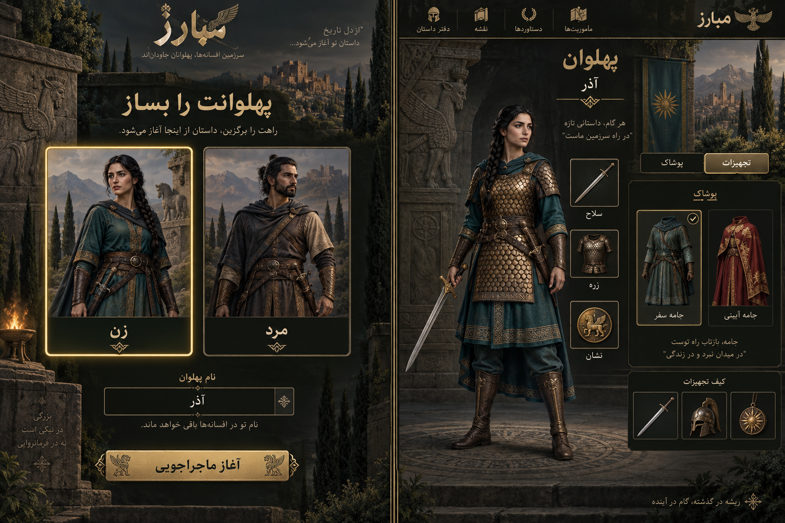
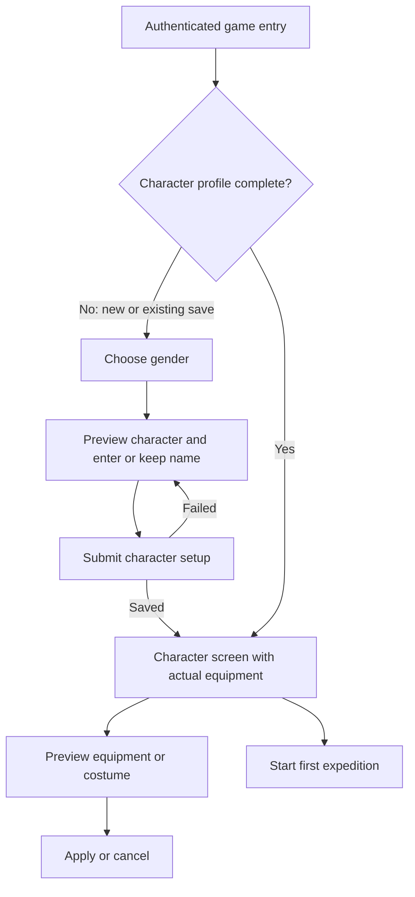

# Mobarez — Character and Equipment UX

**Design date:** 14 September 2026  
**Priority:** U0, the next product milestone  
**Status:** UX specification prepared; gender selection, visible equipment and costumes are implemented in source. Private release and the full browser acceptance matrix are still pending.

[Project overview](../README.md) · [Delivery plan](../PLAN.md) · [Progress and verification](../PROGRESS.md)

## 1. Outcome

The player first chooses a gender, then sees their own full-body Iranian character. Equipping a weapon, armor, or charm visibly changes that character. A wardrobe lets the player preview and wear cosmetic outfits while retaining the effects of combat equipment.

The first successful character setup should lead to **پهلوان**, where the player recognizes their character, understands what they are wearing, and can begin their first expedition.

### Requirements and design defaults

| Decision                         | Direction                                                                         | Basis                                                 |
| -------------------------------- | --------------------------------------------------------------------------------- | ----------------------------------------------------- |
| Gender selection before gameplay | Required first step, with **زن** and **مرد** choices                              | User request                                          |
| Visible character                | Full-body illustration is the central character-screen element                    | User request and supplied overview reference          |
| Equipment on the body            | Weapon, armor and charm visuals reflect equipped items                            | User request                                          |
| Costumes                         | Dedicated **پوشاک** wardrobe with preview and wear actions                        | User request                                          |
| Gender effects                   | Same initial stats, costs, rewards and item availability                          | Design default                                        |
| Changing gender later            | Free appearance edit; preserve the same character and all progress                | Design default                                        |
| Costume effects                  | Cosmetic only; no combat bonuses or replacement of owned equipment                | Design default                                        |
| Initial wardrobe                 | Two free, owned outfits for the private MVP, plus the normal equipment appearance | Design default; no payment or unlock economy required |
| Rendering                        | Layered 2D illustrations using shared pose/anchors                                | Proposed implementation                               |

These defaults make the first implementation concrete. They are product proposals rather than already shipped rules.

## 2. What the references contribute

The four supplied screenshots establish useful visual and spatial patterns:

| Reference            | Useful pattern for Mobarez                                                         | Planned adaptation                                                                                     |
| -------------------- | ---------------------------------------------------------------------------------- | ------------------------------------------------------------------------------------------------------ |
| Overall game screen  | Persistent world atmosphere, resources and section navigation                      | Keep Iranian environment art and compact Persian navigation around the working surface                 |
| Character overview   | Prominent character portrait, equipment slots, nearby bag and character statistics | Make a full-body figure central; place three supported slots beside it and a readable inventory nearby |
| Expedition opponents | Distinct opponent portraits and explicit attack actions                            | Retain the current opponent selection flow; later improve the visual distinction between enemies       |
| Dungeon scene        | A place to explore and an objective associated with it                             | Later present the existing three-stage dungeon through a scene and clear current objective             |

The references show screen structure. They do not establish how Gladiatus internally renders avatars or whether every equipped item changes its portrait. Visible equipment and costumes are explicit Mobarez requirements.

Keep the current olive, charcoal and antique-gold palette, local Persian typography, and RTL reading order. Use Iranian stonework, textiles, cypress and landscape cues. The character creation screen can be more immersive; equipment controls need a quieter background and strong readability.

## 3. Visual concept



This original generated concept shows gender selection and a character-centered equipment/wardrobe composition. It is a static direction image, not a working screen or a validated final asset set.

The illustration includes decorative menu labels and a helmet thumbnail. The first release will expose only existing game sections and the three implemented slots; it does not introduce achievements, maps, or a helmet system. Starter previews must show the actual starter leather equipment. The bronze armor in the concept illustrates a later equipped appearance. The production design will separate equipment and costume tabs and add explicit preview/apply controls as specified below.

Artwork provenance and the exact generation prompt are in [the concept notes](ux/character-concept.md).

## 4. First-time character creation

### Entry and sequence



**One creation screen, two ordered sections:** gender selection comes first; the selected character preview and name follow. Avoid a long wizard before the first fight.

- Show equally prominent adult female and male Iranian warrior cards with the same camera framing, visual quality and practical clothing coverage.
- Start with neither option selected. Selecting a card updates the draft preview immediately and announces the selection.
- Use a native radio group with Persian labels; selection must be visible through text/checkmark as well as color.
- Show the selected full-body preview wearing the player's actual equipment. For a new save, this is the iron blade and leather armor.
- Offer a name field using the existing 2–24-character validation. For an existing save, retain the current name.
- One primary action: **آغاز ماجراجویی** for a new profile; **ثبت ظاهر و ادامه** for a returning player completing appearance setup.
- Place a short explanation under the choice: **این انتخاب فقط ظاهر پهلوان را تغییر می‌دهد؛ توانایی‌ها یکسان‌اند.**
- While no gender is selected, explain the requirement: **برای ادامه، جنسیت پهلوانت را انتخاب کن.**
- During save, retain the preview and show **در حال ساخت پهلوان…**. Disable duplicate submissions, not the whole page's readability.
- On failure, preserve the chosen gender and draft name, show a local error, and allow retry after state reconciliation.
- After success, show **پهلوان** with a short introductory hint and the **نخستین لشکرکشی** action. Do not send the player straight into combat.

### Existing saves

Existing characters must complete the appearance step once. Explain: **پیشرفتت محفوظ است؛ ظاهر پهلوانت را انتخاب کن.** Preserve gold, XP, level, equipment, inventory, quest claims, cooldowns and dungeon progress. Do not grant starter resources again or create a second player row.

Returning players with a completed profile open the character screen directly. They can later choose **ویرایش ظاهر** to switch the gender presentation without recreating their save.

## 5. Character screen layout

### Desktop

Use the existing RTL shell with **پهلوان** as the character hub. Within the main surface:

```text
┌─────────────────────────────────────────────────────────────┐
│ Character name · level                 Edit appearance       │
├──────────────────────────────┬──────────────────────────────┤
│ Equipment / Wardrobe tabs    │ Full-body character stage     │
│                              │                              │
│ Inventory or owned outfits   │ Weapon slot   Character       │
│                              │ Armor slot    from head       │
│ Selected-item comparison     │ Charm slot    to boots        │
│ Preview / Apply / Cancel     │                              │
├──────────────────────────────┴──────────────────────────────┤
│ Health · XP · attack · armor       Start expedition          │
└─────────────────────────────────────────────────────────────┘
```

This diagram uses English labels for stable monospace alignment. All product labels are Persian. The character occupies the right-side main stage; inventory/wardrobe and details are adjacent on the left. The global navigation remains on the right edge of the application.

- Give the figure sufficient height to show head, hands and boots; do not crop it into a portrait card.
- Keep three clearly labeled equipment slots: **سلاح**, **زره**, **نشان**. Their icons identify actual currently equipped items.
- Clicking a slot selects its equipped item and filters the bag to that slot. An empty slot explains how to fill it.
- Show item counts and rarity text, not only colored frames.
- Keep quick statistics below or alongside the stage. Avoid repeating a second large character/stats card beside the main character view.
- Reuse a small cropped portrait from the chosen character in the header/other screens for visual identity. The character hub remains the place for full-body inspection.
- Separate **تجهیزات** and **پوشاک** as local tabs. Changing tabs does not save anything.
- Keep the existing navigation to expeditions, training, market, quests, dungeon and reports.

### Mobile

Order the content vertically: name/level → full-body stage and three slots → compact stats → equipment/wardrobe tabs → inventory → selected-item details.

- Use a stage that scales as one unit; body and equipment layers must never resize independently.
- Slots remain labeled, touchable and beside or immediately below the figure, with non-overlapping targets of at least 44px.
- Selecting an inventory item opens a detail sheet with a small appearance preview, stat comparison, and **پوشیدن / انصراف** actions.
- Use one vertically scrolling screen and a sheet whose content can scroll; do not require horizontal bag scrolling or hover tooltips.
- Preview/apply controls stay clear of browser safe areas and the on-screen keyboard. The name field and validation message remain visible during editing.
- Drag-and-drop is optional later. Every action must work with click, touch and keyboard from the first release.

## 6. Equipment interactions

### Select → compare → preview → apply

1. Select an owned item from the bag or a current equipment slot.
2. Show its Persian name, rarity, count, slot and effects.
3. Compare it against the item currently occupying that slot. Show resulting attack, armor and maximum-health changes, with labels for increases, decreases and unchanged values.
4. **پیش‌نمایش** changes the displayed character and preview values only. Mark the stage **پیش‌نمایش — هنوز ثبت نشده**.
5. **پوشیدن** submits one server action. The committed character and stats update only after a successful response.
6. **انصراف** restores the committed appearance and closes the comparison.

The preview can be the default state when selecting an item, with the same explicit unsaved label and Apply/Cancel controls. Do not require an extra preview click if it adds no useful distinction.

### Actions and edge cases

| Situation                           | UX behavior                                                                                                     |
| ----------------------------------- | --------------------------------------------------------------------------------------------------------------- |
| Equipped item selected              | Label **پوشیده‌شده**; offer **از تن خارج کن**                                                                   |
| Duplicate item selected             | Show owned quantity and whether one copy is equipped                                                            |
| Last equipped copy offered for sale | Explain **ابتدا از تن خارج کن**; retain server ownership checks                                                 |
| Sell action                         | A compact confirmation identifies item, quantity one, and received gold; removal is explicit                    |
| Armor increases maximum health      | Explain added capacity; do not imply current health is fully restored                                           |
| A preview is cancelled              | No save revision or inventory/stat change                                                                       |
| Equip request fails                 | Retain the existing equipped item and values; show the failure beside the action                                |
| Another tab updates the save        | Refresh/rebase the selection and recompute the comparison before allowing Apply                                 |
| Costume conceals equipped armor     | Show **زره فعال است؛ پوشاک ظاهر آن را پوشانده** and a preview toggle for normal equipment appearance            |
| Item artwork fails to load          | Keep the correct item icon/name and a labeled unavailable-appearance state; never imply the item was unequipped |

A costume must not make the player think armor has stopped working. Slot icons and combat stats always describe real equipped items, including while the costume is visible.

## 7. Wardrobe and costumes

### First-release content

Proposed wardrobe choices:

| Choice           | Appearance                                 | Availability                          | Effect               |
| ---------------- | ------------------------------------------ | ------------------------------------- | -------------------- |
| **نمای تجهیزات** | Show the actual armor and equipment layers | Always available                      | Clear active costume |
| **جامهٔ سفر**    | Practical teal travel clothing and mantle  | Owned for every private-MVP character | Appearance only      |
| **ردای آیینی**   | Crimson/gold ceremonial robe or cloak      | Owned for every private-MVP character | Appearance only      |

Both costumes need equally complete male and female artwork. They do not consume equipment inventory capacity, add rarity bonuses, or require a premium currency. Acquisition/unlock mechanics can be designed later without blocking the user's requested dressing experience.

### Interaction

- Show owned costumes as labeled thumbnails, with **پوشیده‌شده** on the active one.
- Selecting a costume previews the character, while equipment and stats remain visible.
- Show **فقط ظاهر را تغییر می‌دهد** in the wardrobe.
- **پوشیدن لباس** commits the selected costume; **انصراف** restores the saved look.
- **نمای تجهیزات** removes the cosmetic override and reveals the currently equipped armor.
- A local **نمایش تجهیزات زیر پوشاک** preview toggle temporarily reveals armor without unequipping the costume. Label this viewing state explicitly.
- Switching gender selects that gender's matching costume assets automatically; it does not remove the costume or its ownership.
- If a costume lacks an asset for either gender, it is not release-ready. Do not silently fall back to the other gender.

### Visual precedence

When no costume is active, show actual armor. When a costume is active, its body clothing replaces the visible torso/leg armor presentation. The underlying equipped armor keeps its combat effects. Weapon and charm remain visible using their matching overlays. Author costume assets to keep hand and charm anchor areas usable.

## 8. Character art and rendering contract

### Layered 2D character

Use a fixed-pose, full-body character with transparent raster layers. Displaying equipment icons around an unchanged portrait does not satisfy the requirement.

Suggested composition order:

1. Shared scene background.
2. Rear costume elements such as a cape.
3. Gender-specific base body in practical underclothing.
4. Actual armor layer **or** active costume body/front layer.
5. Equipped weapon layer.
6. Hand/grip occlusion layer, where required by the pose.
7. Equipped charm layer.

The art manifest can split a garment into rear/front parts when needed. Foreground UI labels stay outside the character image stack.

### Asset specification

- Author both base bodies on a shared proposed `1024 × 1536` canvas, facing the same direction in a compatible neutral pose.
- Lock camera, scale, foot position, hand anchors, neckline/charm anchor, light direction and shadow treatment before producing gear variants.
- Keep every wearable export at the same full-canvas dimensions with a genuine alpha channel; do not independently trim or center overlays.
- Scale the whole stage responsively. Each layer uses the same origin and `object-fit` behavior.
- Make base clothing usable when armor is removed; never render nudity as the unequipped state.
- Create both gender variants for every supported wearable. Avoid visual quality, protection or equipment-access differences between them.
- Use the same selected visual state to derive small portraits. Do not maintain unrelated profile art that contradicts the full-body view.
- Preload the selected appearance; preview candidates load on selection, with reserved dimensions and a visible loading state.
- Generate art during development and save approved assets in the project. Gameplay must not depend on a live image-generation request.

### Minimum production asset matrix

| Asset family          | Required variants                                                    |
| --------------------- | -------------------------------------------------------------------- |
| Base character        | Two genders, one fixed pose each                                     |
| Weapons               | Iron blade, bronze blade, sun blade × two genders                    |
| Armor                 | Leather, scale, guardian × two genders                               |
| Charms                | Cypress, Simorgh × two genders                                       |
| Costumes              | Travel, ceremonial × two genders; rear/front exports as required     |
| Scene                 | One quiet Iranian character-stage background                         |
| Chooser/thumbnail art | Derived or separately authored to match the approved full-body looks |

This is a matrix of supported appearances, not a promise that each requires only one exported file. Hand masks and split garments can increase export counts.

**Art acceptance:** test each wearable on both bases, inspect a contact sheet of every gear combination, and inspect costume combinations with weapons/charms. Check necklines, wrists, feet, alpha edges, clipping and material overlap. A static concept image cannot substitute for that compositing test.

### Proposed asset manifest

Use stable visual IDs and explicit body-specific paths; avoid constructing filenames from unchecked user input. A missing mapping is an asset-validation failure. Keep art IDs independent from item display names and preserve existing gameplay item IDs.

## 9. Save model and server behavior

The current game stores unversioned JSON and has no gender or costume fields. Add a minimal versioned migration before relying on the new fields.

Proposed additions:

```ts
// Proposed design: not present in the current engine.
type CharacterAppearance = {
  gender: 'female' | 'male' | null;
  activeCostumeId: string | null;
};

type CharacterProfileFields = {
  saveVersion: 1;
  characterCreated: boolean;
  appearance: CharacterAppearance;
  ownedCostumeIds: string[];
};
```

Retain the existing `name`, equipment, inventory, stats and progression fields. A legacy save normalizes to `characterCreated: false`, `gender: null`, and the initial owned costumes, without changing existing gameplay values. The new-character initializer uses the same incomplete-profile state.

| Proposed action                          | Validation and result                                                                                                           |
| ---------------------------------------- | ------------------------------------------------------------------------------------------------------------------------------- |
| `createCharacter` with `gender`, `name`  | Authenticated owner, incomplete profile, allowed gender and valid name; mark complete once, without re-granting starter rewards |
| `setGender` with `gender`                | Completed profile and allowed value; preserve equipment, wardrobe and progression                                               |
| `wearCostume` with `costumeId` or `null` | Completed profile; ID exists and is owned, or clear the costume                                                                 |
| Existing equip/unequip actions           | Continue changing real equipment and stats; resolve their matching visible layers                                               |

Use the current revision-checked write path for migration and mutations. Apply full runtime validation to new actions. A migration racing with another request must not overwrite a later save. Keep preview selection, wardrobe-tab selection, and the “show gear underneath” toggle in client UI state, outside the persistent appearance.

Before setup completes, allow loading state and completing setup; reject other gameplay mutations server-side. Existing and new players can inspect the setup screen without an automatic gender assignment. Resolve recovery and retry behavior for an uncertain setup response using the saved profile state.

**Invariant:** gender and costume values never enter `derived`, damage, drop chances, prices, XP gains, health recovery or region unlock calculations. Tests must prove this with identical gameplay states.

## 10. Suggested component boundaries

| Component / module          | Responsibility                                                             |
| --------------------------- | -------------------------------------------------------------------------- |
| `CharacterCreation`         | Gender choice, draft name, selected appearance, creation errors and submit |
| `CharacterStage`            | Render a supplied appearance/equipment state; owns no gameplay mutation    |
| `EquipmentSlot`             | Accessible slot selection, empty/equipped labels and item identity         |
| `EquipmentInventory`        | Owned equipment, counts and slot filter                                    |
| `ItemComparison`            | Current/candidate effects, preview status, Apply/Cancel                    |
| `Wardrobe`                  | Owned costumes, current selection, preview, Apply/Clear                    |
| `CharacterAppearanceEditor` | Change gender later while preserving progress                              |
| `character-art.ts`          | Typed, validated asset mappings and visual-layer resolution                |
| Save migration helper       | Normalize legacy state once while preserving all existing fields           |

Continue using shared Button, Input, Dialog, and Progress primitives. Add suitable shared radio/tab/sheet primitives when implementing those interactions. Extract the character flow from the existing large page component as part of this feature, with a focused boundary rather than an unrelated application-wide refactor.

## 11. Delivery sequence

| Slice | Deliverable                                                                                           | Depends on                           | Completion evidence                                              |
| ----- | ----------------------------------------------------------------------------------------------------- | ------------------------------------ | ---------------------------------------------------------------- |
| U0.1  | Save migration, validated creation action, required gender/name setup and arrival on character screen | Current save/API; base character art | New and legacy profiles complete setup once and reload correctly |
| U0.2  | Visible equipment for all eight existing items, slots, comparison and Apply/Cancel                    | U0.1; approved wearable asset matrix | Every existing item renders on both character bases              |
| U0.3  | Two cosmetic outfits, wardrobe, clear costume and later gender edit                                   | U0.2; matching costume artwork       | Appearance persists and gameplay values remain equivalent        |
| U0.4  | Mobile/keyboard pass, existing-save and concurrency regression, private release                       | All preceding slices                 | Recorded browser, engine, migration and API checks               |

For U0.1 evidence, verify that both new and existing users complete setup once and reload into the correct character. For U0.2, verify each equipped item changes the figure and its real effects consistently. For U0.3, verify outfit changes persist while combat results remain equivalent. For U0.4, use the acceptance matrix below and update PROGRESS with actual results.

The small appearance/save migration is a prerequisite of U0, even though the broader save-recovery project remains in P1. Existing reward bugs and P0 verification remain release work; the UX milestone does not mark them resolved.

## 12. Acceptance matrix

| Scenario                                      | Required result                                                                         |
| --------------------------------------------- | --------------------------------------------------------------------------------------- |
| New authenticated player                      | Gender choice is first; no default assignment or bypass through gameplay API            |
| Existing save without appearance              | One setup step; all gold, items, quests and progress retained                           |
| Both gender choices                           | Same stats, item availability, costs, rewards and unlocks                               |
| Setup success and reload                      | Same chosen gender/name and actual starter or saved equipment                           |
| Double submission or uncertain network result | One completed profile; no extra starter rewards; recovered committed result             |
| Equip each existing item on either gender     | Correct weapon, armor or charm visibly appears                                          |
| Remove armor                                  | Base travel underclothing appears; combat armor changes normally                        |
| Select then cancel an item preview            | No mutation of saved equipment, inventory, stats or revision                            |
| Equip while another tab changes the save      | Reconcile state; no stale comparison applied silently                                   |
| Wear either costume on either gender          | Matching complete outfit; equipment stats unchanged                                     |
| Reveal gear under a costume                   | Viewing mode only; costume remains saved and active                                     |
| Clear costume                                 | Actual equipped armor reappears without item/stat changes                               |
| Switch gender later                           | Correct artwork for all current gear/costume; progress preserved                        |
| Missing or slow artwork                       | Reserved layout, explicit loading/error state and retry; controls remain comprehensible |
| Phone + on-screen keyboard                    | Name and actions stay visible; no required hover, dragging or horizontal page scrolling |
| Keyboard and screen reader                    | Gender group, slots, tabs and dialogs labeled; focus and feedback predictable           |

Automated tests should cover migration invariants, action validation, ownership, retries, preview isolation and gender/costume stat equivalence. Browser checks should cover actual layer composition, responsive layout, keyboard/touch input and visible feedback. Record those as separate kinds of evidence.

## 13. Following UX work

After U0, refine the current expedition cards and dungeon scene using the supplied references: more distinct enemy portraits, clearer rewards and a visible current dungeon objective. This is a subsequent UX pass; additional zones, extra equipment slots, party combat and costume monetization are not dependencies of character creation and dressing.
